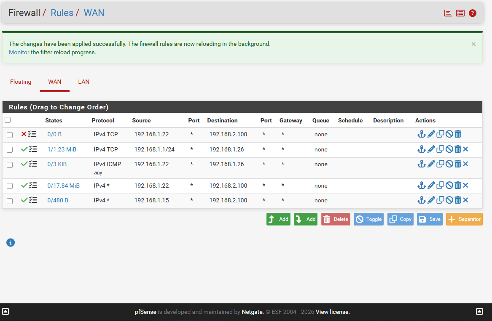
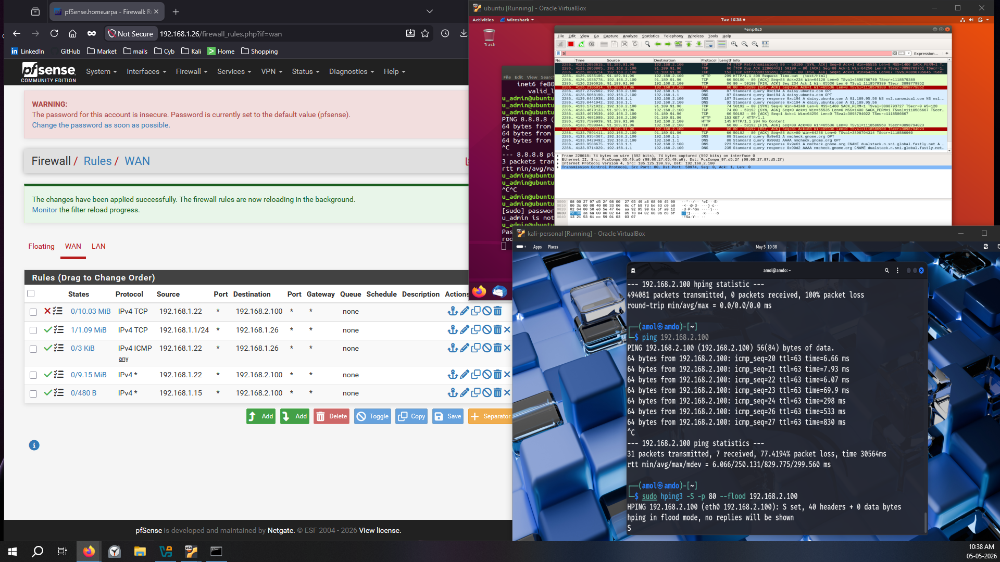
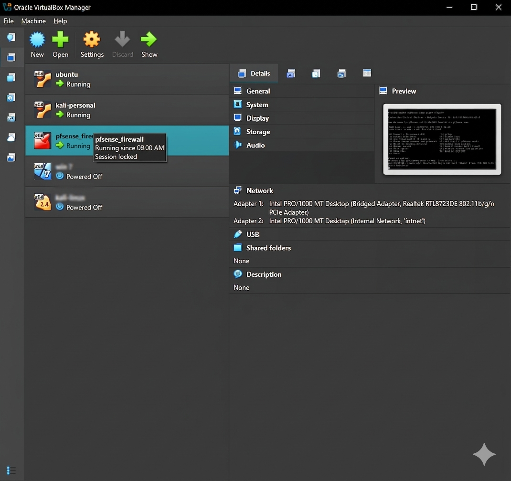

# 🔥 Network Perimeter Defense Lab: Real-Time DoS Attack Simulation & Firewall Mitigation

> **Simulated a volumetric Denial-of-Service attack against an isolated LAN target, captured live traffic with Wireshark, then engineered pfSense firewall rules that reduced malicious packet throughput to zero — all inside a fully self-contained VirtualBox environment.**


---

## 📋 Table of Contents
- [Project Overview](#-project-overview)
- [Lab Architecture & Topology](#-lab-architecture--topology)
- [Technical Stack](#-technical-stack)
- [Methodology](#-step-by-step-methodology)
- [Key Findings & Results](#-key-findings--results)
- [Screenshots](#-screenshots)
- [Skills Demonstrated](#-skills-demonstrated)
- [Takeaways & Next Steps](#-takeaways--next-steps)

---

## 🔍 Project Overview

Most firewall guides tell you what to click. This lab forces you to **feel** the attack first.

A three-VM environment was architected in VirtualBox to emulate a real-world scenario: an external attacker on the WAN segment launching a flood attack against an internal workstation. Before any defensive rules were in place, a SYN/ICMP flood from Kali Linux (via `hping3`) successfully overwhelmed the Ubuntu victim — confirmed by Wireshark capturing thousands of packets per second and measurable internet disruption on the target.

The defense phase involved engineering a block rule at the pfSense WAN interface, which was verified live: `hping3` reported 100% packet loss on the attacker side, Wireshark traffic on the victim dropped to baseline, and pfSense firewall logs confirmed every blocked packet.

**The result: a measurable, evidence-backed demonstration of firewall rule efficacy — not a simulation of a simulation.**

---

## 🏗 Lab Architecture & Topology

```
┌─────────────────────────────────────────────────────────────────┐
│                     HOST MACHINE (VirtualBox)                   │
│                                                                 │
│  ┌──────────────────┐        ┌──────────────────────────────┐  │
│  │  KALI LINUX      │        │       pfSense FIREWALL       │  │
│  │  (Attacker)      │        │                              │  │
│  │  192.168.1.22    │◄──────►│  WAN: 192.168.1.26 (Bridge) │  │
│  │  Bridged Adapter │  WAN   │  LAN: 192.168.2.1  (IntNet) │  │
│  └──────────────────┘        └──────────────┬───────────────┘  │
│                                             │ Internal Network  │
│                                             │ (LabNet)          │
│                                   ┌─────────▼──────────┐       │
│                                   │  UBUNTU DESKTOP    │       │
│                                   │  (Victim)          │       │
│                                   │  192.168.2.100     │       │
│                                   │  Internal Adapter  │       │
│                                   └────────────────────┘       │
└─────────────────────────────────────────────────────────────────┘
```

| Device | VirtualBox Adapter | IP Address | Role |
|--------|--------------------|------------|------|
| pfSense WAN | Bridged | 192.168.1.26 | Edge Firewall |
| pfSense LAN | Internal `LabNet` | 192.168.2.1 | Default Gateway / DHCP |
| Kali Linux | Bridged | 192.168.1.22 | External Attacker |
| Ubuntu Desktop | Internal `LabNet` | 192.168.2.100 | Victim Workstation |

---

## 🛠 Technical Stack

| Category | Tool / Technology |
|----------|-------------------|
| **Firewall / Router** | pfSense CE 2.7.x (FreeBSD-based) |
| **Attack Platform** | Kali Linux (hping3) |
| **Victim / Monitor** | Ubuntu 22.04 Desktop |
| **Packet Analysis** | Wireshark |
| **Virtualisation** | Oracle VirtualBox 7.x |
| **Networking** | Bridged + Internal Network adapters, Static Routes, DHCP scopes |
| **Attack Vector** | SYN Flood (TCP Port 80) + ICMP Flood via `hping3 --flood` |

---

## 🔬 Step-by-Step Methodology

### Phase 1 — Environment Provisioning

Deployed three VMs in VirtualBox with deliberately isolated network segments. pfSense was configured with **two adapters**: Adapter 1 (Bridged) as the WAN-facing interface reachable from Kali, and Adapter 2 (Internal Network `LabNet`) as the LAN gateway for Ubuntu. Ubuntu received a DHCP lease (192.168.2.100) from pfSense's configured scope (`.100–.199`).

A static route was injected into Kali to ensure reachability to the LAN subnet through the pfSense WAN IP:

```bash
sudo ip route add 192.168.2.0/24 via 192.168.1.26
```

Connectivity was validated end-to-end: Kali → pfSense WAN → Ubuntu LAN.

---

### Phase 2 — Pre-Mitigation: DoS Attack Execution

With a permissive WAN rule in place (intentionally allowing Kali → Ubuntu traffic), the DoS attack was launched from Kali using `hping3` in two modes:

**ICMP Flood:**
```bash
sudo hping3 -1 --flood 192.168.2.100
```

**SYN Flood (TCP Port 80):**
```bash
sudo hping3 -S -p 80 --flood 192.168.2.100
```

**Observed Impact (Pre-Mitigation):**
- Wireshark on Ubuntu captured a packet storm: thousands of TCP SYN segments per second from source `192.168.1.22`, all marked RST/ACK — classic SYN flood signature
- Ubuntu's internet connectivity degraded measurably (ping to 8.8.8.8 showed 77%+ packet loss)
- `hping3` statistics confirmed 236,492+ packets transmitted with 0 replies — a full one-sided flood

> *Screenshot 1 and 2 below document this phase — note Wireshark row density and the ping statistics on the Kali terminal.*

---

### Phase 3 — Firewall Rule Engineering (Mitigation)

Navigated to pfSense WebGUI → **Firewall → Rules → WAN** and inserted a **Block rule at the top of the ruleset** (rule order is critical in pfSense — first match wins):

| Field | Value |
|-------|-------|
| Action | **Block** |
| Interface | WAN |
| Protocol | Any |
| Source | 192.168.1.22 *(Kali IP)* |
| Destination | 192.168.2.100 *(Ubuntu IP)* |
| Log | ✅ Enabled |
| Description | Block Kali DoS |

Applied the rule and triggered a firewall reload.

---

### Phase 4 — Post-Mitigation Verification

**Multi-point verification was performed:**

1. **Attacker side (Kali):** `hping3` immediately reported `100% packet loss` — zero packets reaching the target
2. **Victim side (Ubuntu):** Wireshark traffic dropped to baseline; no further SYN flood packets visible
3. **Firewall logs (pfSense):** Confirmed every blocked packet logged against the new rule, providing an auditable record of the attack being neutralised
4. **Connectivity restored:** Ping from Ubuntu to 8.8.8.8 resumed successfully after the rule was applied

---

## 📊 Key Findings & Results

| Metric | Pre-Mitigation | Post-Mitigation |
|--------|---------------|-----------------|
| Flood packets reaching Ubuntu | **Hundreds of thousands** | **0** |
| Ubuntu internet packet loss | **~77%** | **< 1%** |
| hping3 packets received (attacker) | 0 (one-way flood) | 0 (blocked at firewall) |
| Wireshark SYN storm visible | ✅ Yes | ❌ No |
| pfSense block log entries | N/A | ✅ Confirmed |

---

## 📸 Screenshots

### 1. Active DoS Attack — Wireshark Capturing SYN Flood + hping3 Running
> *Shows hping3 in flood mode from Kali (bottom-right), Wireshark on Ubuntu capturing the TCP SYN storm (top-right), and pfSense WAN rules before the block rule was added (left).*



---

### 2. Flood Traffic at Scale — Wireshark Packet Density
> *Wireshark captures 377,065 packets during the flood window. hping3 statistics show 236,492 packets transmitted, 0 received — confirming unidirectional flood behavior.*



---

### 3. VirtualBox Lab Environment — All Three VMs Running
> *Confirms all three nodes (Ubuntu, Kali-personal, pfsense_firewall) are live simultaneously. pfSense network configuration visible: Adapter 1 Bridged, Adapter 2 Internal Network `intnet`.*



---

### 4. Post-Mitigation — Block Rule Applied, Traffic Halted
> *pfSense WebGUI showing the block rule at the top of the WAN ruleset. hping3 on Kali reports 100% packet loss. Ubuntu internet connectivity restored.*


---

## ✅ Skills Demonstrated

### 🔵 Network Security / Blue Team
- Firewall rule engineering (stateful filtering, rule ordering, logging)
- Denial-of-Service attack analysis and mitigation
- Network traffic analysis with Wireshark (TCP flag inspection, packet storm identification)
- Threat emulation using industry-standard tools (hping3)

### 🟣 Networking & Infrastructure
- Multi-segment network design (WAN/LAN isolation)
- DHCP scope configuration and IP addressing
- Static route injection and routing verification
- VirtualBox network adapter types (Bridged vs Internal Network)

### 🟢 SOC / Analyst Skills
- Identifying attack signatures in packet captures (SYN flood, ICMP flood)
- Correlating attacker behavior with victim-side impact
- Verifying mitigation efficacy via firewall logs and traffic baselines
- Evidence-based documentation of attack lifecycle

---

## 🚀 Takeaways & Next Steps

**What this lab proves:** A single correctly-placed firewall rule — positioned before permissive rules — can reduce volumetric flood traffic to zero. Rule order is not administrative preference; it is the mechanism.

**Planned extensions:**
- [ ] Deploy Snort/Suricata IDS on pfSense for signature-based detection
- [ ] Implement pfSense traffic shaping / rate limiting as a secondary layer
- [ ] Extend to DDoS simulation with multiple source IPs
- [ ] Add SIEM integration (e.g., Graylog) to centralise pfSense logs
- [ ] Introduce a Web Application Firewall (SafeLine WAF) in front of Ubuntu

---

## 📁 Repository Structure

```
Network Perimeter Defense Lab: Real-Time DoS Attack Simulation & Firewall Mitigation/
├── README.md
├── screenshots/
│   ├── pre_mitigation_dos_attack.png
│   ├── wireshark_flood_density.png
│   ├── virtualbox_lab_setup.png
│   └── post_mitigation_blocked.png
├── configs/
│   └── pfsense_wan_rules_export.xml   # (optional: export from pfSense)
└── project-brief.pdf
```

---

